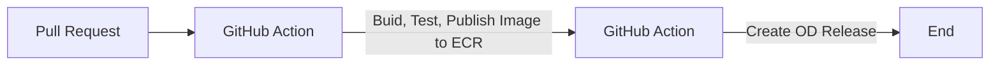

# octo-demo 
Demonstration of how to integrate a CI process with Octopus Deploy 

## CI/CD flow

## Versioning
This repo uses the SemVer approach to versioning. It's automatically incremented by each commit, commits in branches other than main have branch name appended to the version (e.g. 1.0.0-SuperNewFeature).

### Note
To bump the major version include (MAJOR) in the commit text.\
to bump the minor version include (MINOR) in the commit text.

## Releases
Releases matching the version which has been built can be found in the Octopus Deploy dashboard.
